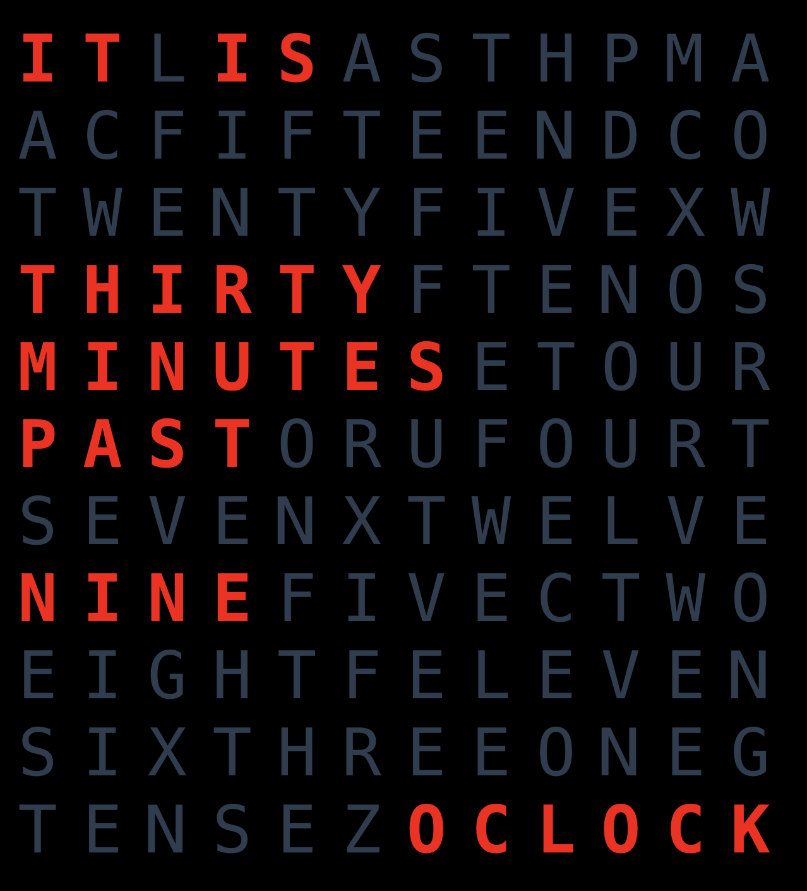

# ⏰ Wordclock

It is a beautiful clock based on words which you can run on your browser.
See here how it looks in action:




## Project setup

Run the following command to install the project:

```
npm install
```

### Compiles and hot-reloads for development
```
npm run serve
```

### Compiles and minifies for production
```
npm run build
```

### Lints and fixes files
```
npm run lint
```
